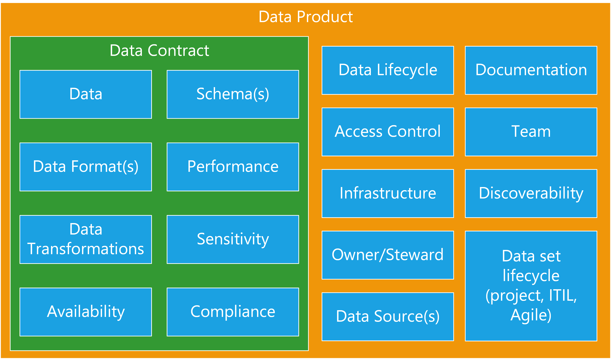

# Agile Data Architecture

## Introduction

This guide does not show *an* architecture, it is a discussion of how to put an agile platform together. By the very nature of agility your platform will end up a heterogeneous collection of multiple architectures, some of which will be derived from standard patterns such as data ingestion. While this has been designed to be complimentary to automated testing and DevOps neither of these are necessary to the architectural principles. Some of your products may be built using Agile, DevOps, Scrum and some may use a more traditional change control, ITIL, waterfall model. The important part here is that each product can be run in the best way for that product. 

### Why a different architecture?

* Team Size
  * Traditional approaches can lead to teams becoming very large and difficult to manage
* Number of Teams
  * Monolithic architectures can make it challenging to split work between multiple teams who are forced to work on the same platform, necessitating stringent change controls
* Dependencies
  * End to end design requires every component to align to others. A more modular encapsulated approach reduces this and encourages components and stages to be well defined in their own right
* Complexity
  * As the size of an architecture increases, complexity will increase in an exponential way. Keeping each architecture small ensures simplicity and makes change faster and lowers risk

## Loose Coupling

* Tightly Coupled
  * Changes are big
  * Hard to experiment
  * Evolution is resisted
  * Costs is built in
  * On-prem design patterns
  * Solution scales together
* Loosely Coupled
  * Changes are small
  * Experimentation is easy
  * Evolution is natural
  * Cost is easier to optimise
  * Cloud design patterns
  * Components scale independently

### Heterogeneous

* Targeted architectures
  * Best architecture for the job
  * Sized appropriately
  * No exception raising processes
* Increases flexibility
* Reduces friction
* Re-use through code

## Encapsulation

* Reduce product scope
* Everything self contained
* Single deliverable, single purpose
* Reduce change requests
  * Change log
* Isolated deployments
  * Lower risk
  * Faster deploys
  * More throughput (velocity of work)

## Product Thinking

* Customers
  * Features
  * Requests
  * Feedback
  * Popularity
  * Competition
    * One source of the truth is the enemy of optimisation and evolution
    * Different people need different truth
  * Splitting due to different needs
* Cost
  * Value based charging
  * Easy to see demand justification
* Product Managers and Owners

## Data Products

* Contract
  * What we deliver
  * SLAs
  * Compliance
  * Ownership
  * Governance information
* Design for discoverability
  * Include metadata
  * “Public” Documentation
  * Catalogues, repositories, libraries, Intranet sites

## Decentralisation

* Decentralisation reduces large complex projects
* Feed up the things that are necessary
  * But do the work locally
* Catalogue/data lineage is a good example
  * Why centralise?
  * People can discover, NHS is a great example
  * Lineage can be written into the data, more discoverable and harder to break

## Requirements

* Rethink what is a real requirement and what is just the way it’s done
* Identity
  * Does it need to be centralised? Introduces change controls and slows progress
* Catalog
  * Does a central catalogue add anything? Sharepoint sites can be more discoverable for real users looking for data
* Glossary
  * Standard words can be useful within a business but don’t scale well and often different BUs use different terms for good reasons. Do we need two weeks of workshops to decide between product, SKU, item, bundle etc. or should we just pick a term and run with it, changing where necessary later

## Patterns

* A Data platform has no required components
  * Standardisation and patterns are by definition non-optimal
  * Good, well documented interfaces between projects
* Start from a blank sheet and add what’s needed
  * Optimise at every step
  * Use the best tool for the job
* Skills are more useful than patterns

## Staging

* Understand what deployment stages are
  * Dev is where you develop
  * Test might be ephemeral
  * Production is the service with SLAs
* Understand data classification
  * Primary data needs controls but can be used everywhere
  * Safe data needs fewer controls but is less useful
  * Test data is not derived from primary data
    * Based on your tests to produce expected results

## Data Classification

[Data Classification](architecture/dataClassification.md)