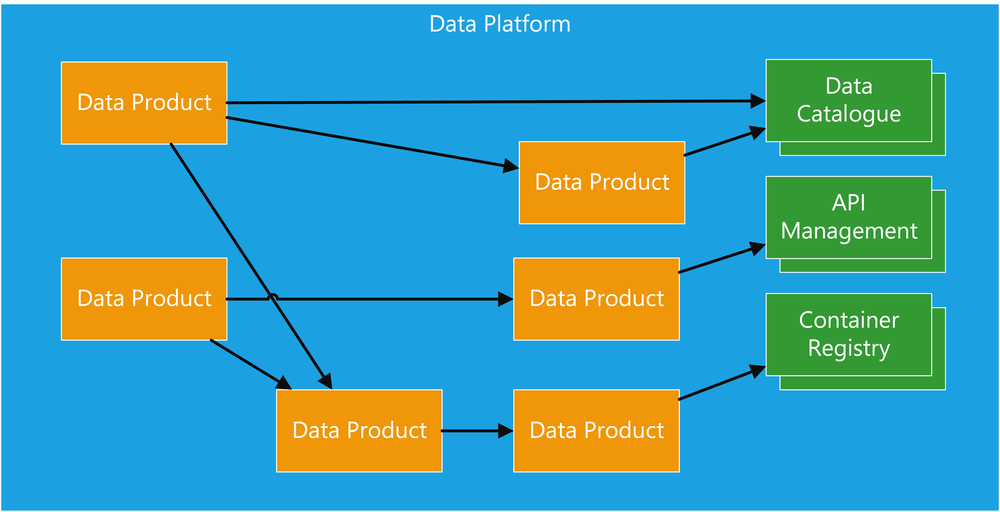
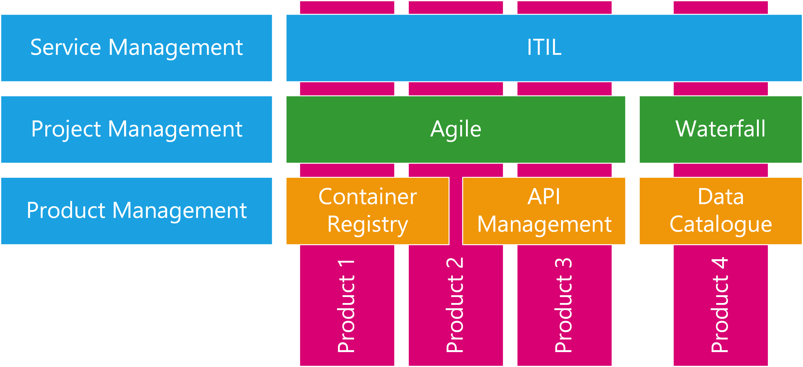
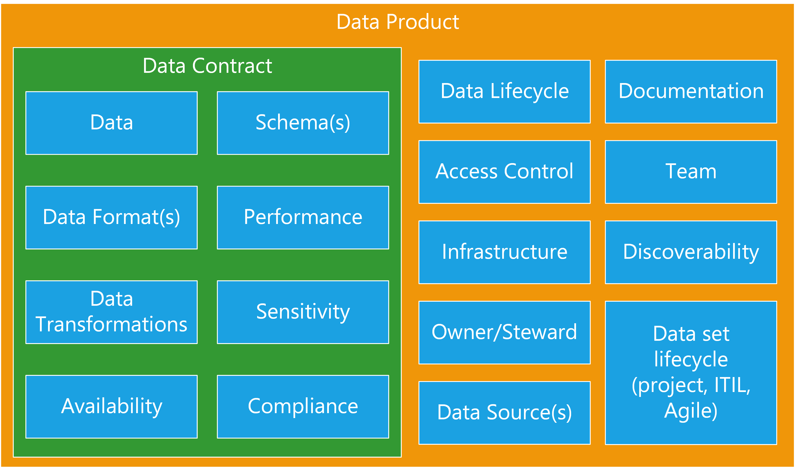
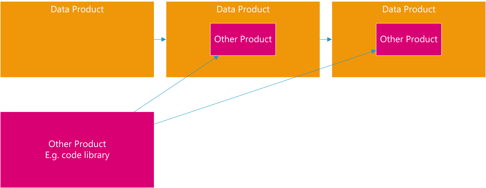
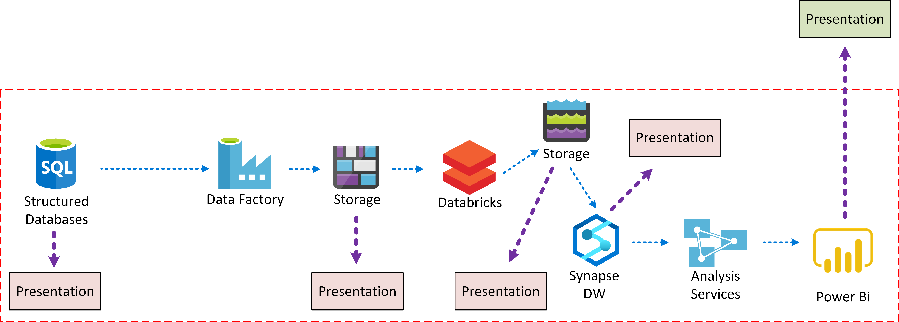
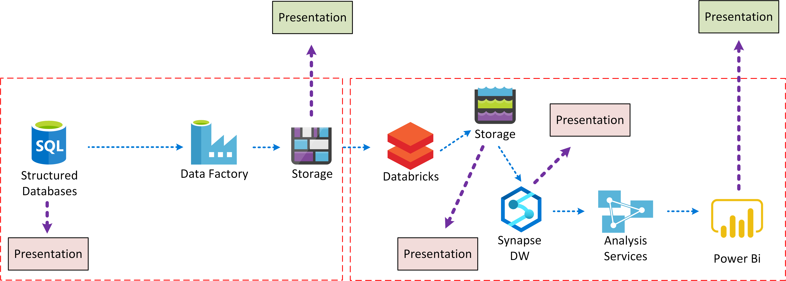
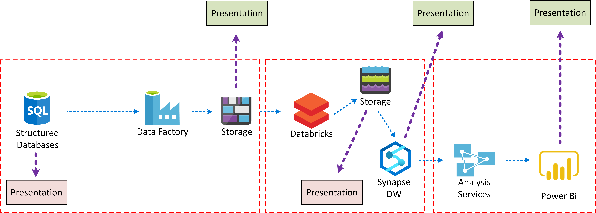
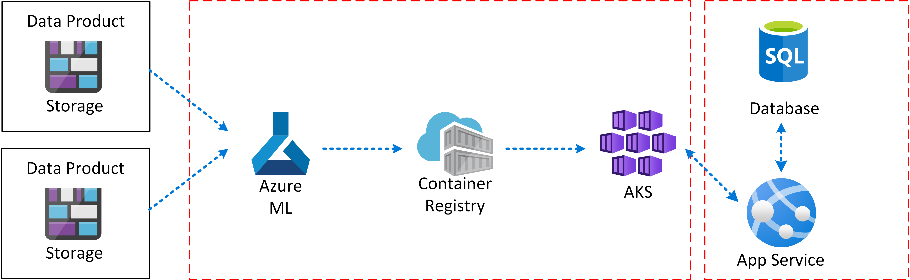
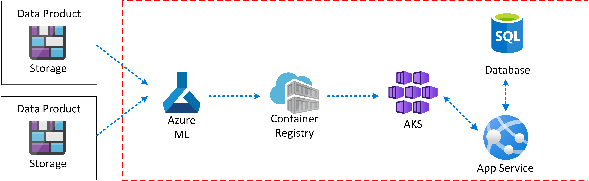

# Data Platforms

**produced by Dave Lusty**

## Introduction

This document aims to set out what a data platform is and what is necessary to make it workable. I have tried to minimise complexity here for the sake of clarity, and have tried to keep all terms used as simple as possible. The concepts here align well with the distributed data mesh concepts published elsewhere, the aim here is to explain how you might go about using those concepts in a real world platform. It's important to understand that most of the ideas here require operational change in how the data team works on a day to day basis, and how it interacts with the wider business.

## Data Platform

At it's simplest, a data platform consists of a set of data products which will each house some kind of solution, be it a data set, a streaming data analytics solution, or a machine learning model. It is also generally useful, but not essential, to add some governance tooling as data products in your environment, in order to make your data sets and other products discoverable. These may include one or more container registries, API management portals, and data catalogues. Each product is an encapsulated system with known outputs and inputs. I have chosen to avoid going into technical architecture at this stage, because it distracts from the real challenge of a data platform which is how it fits within the organisation, who manages and maintains it, and who builds it? These questions must be answered before you can decide any technical aspects of the design, and they will heavily influence that design. Please bear in mind that this document describes a "cloud" data environment. If you are building a legacy architecture where you deploy the platform and then fill it with data, this document is not for you. This architecture is cloud native from the ground up, meaning that components are deployed as needed and the solution is modular with individually scaled parts. That is not to say this must be public cloud, nor that we can't use shared components. An example of a shared component might be a storage account where we "deploy" a container for a new data product rather than deploying a new storage account. A data product can, and often will be implemented using traditional on-premises data products. The idea of cloud architecture is related to the way we implement and scale a solution in a more modular way.

<table>
<tr>
<td width="15%">&nbsp;</td>
<td width="70%"></td>
<td width="15%">&nbsp;</td>
</tr>
</table>

### Governance Tooling

The platform will use multiple layers of management tooling for different purposes. These are important for creating and developing the products, managing and maintaining, and for discovering the products. Each product might fit with one or more management tools in each layer.

<table>
<tr>
<td width="15%">&nbsp;</td>
<td width="70%"></td>
<td width="15%">&nbsp;</td>
</tr>
</table>

#### IT Service Management

This whole platform is designed to sit within some kind of a service oriented architecture, and so it is quite likely that you will have something like ITIL sitting above it and managing access and change. Each data product will likely have some kind of request system to get access, alongside an approval process and possibly also an automated system to make those changes. This layer is considered out of the scope of this documentation, and does not materially affect the architecture.

#### Project Management and Development

Each product in the platform will have a development lifecycle which will differ based on the type of product it is. For instance, a data catalogue product might be implemented in a more traditional project management approach and then considered "finished". Other products might use DevOps and Agile approaches to ensure there is a strong feedback loop with the customers of the product, and continuous development.

#### Product Management

Each product will have some kind of output, whether that's a data set, ML model, container image, API or code library. Each of these would potentially be registered into a management solution to make it discoverable by the wider community whether that be inside of the business or outside.

**Data Catalogues** - You might need one or more data catalogues to make your data sources and data sets discoverable, and as a place to store documentation and metadata about those data sets. These can either be centralised in the business, or community driven depending on how the business users operate, and how related the various data sets are. You may also have external data catalogues which are more carefully curated to be customer facing.

**Object Repositories** - If you develop code then you almost certainly will need an internal object repository such as Azure Artifacts. This will be used to store your internally developed code libraries ready to deploy into your projects. Often you will also want to replicate public library sources for internal use to ensure that there is no disruption to your projects if that public source disappears or has an outage, as well as keeping previous versions in case a bug is introduced.

**Container Registries** - Many products such as machine learning will output a container image. This image needs to be stored somewhere appropriate ready for deployment into a service. Container registries are the way to store and document these images.

**API Management** - Often your products will surface an API which can be consumed by the business, for instance where a machine learning model has been deployed into service form. In this instance, you will need one or more API Management portals to allow developers to easily consume your API. Often you will need separate portals for internal and external use, as well as potentially separating by developer community where appropriate.

## Data Products

Data products are the basic component of the platform. Each data product is a self contained and self describing product that must form a contract with the outside world and must be discoverable. In an ideal world, a data product should not have any tightly coupled dependencies and while it may depend on other data products, that relationship should be loosely coupled such that, for instance, late processing of one does not affect the other. If tight coupling is required, for instance to meet processing time requirements, then it is often better to encapsulate the whole process inside a single product. While this might mean duplication of effort in some cases, it is ultimately more manageable in the long term. Often a data product will map one to one with some kind of project and team, but sometimes it can be convenient to develop multiple products within a project and to share resources from one team across them.

<table>
<tr>
<td width="15%">&nbsp;</td>
<td width="70%"></td>
<td width="15%">&nbsp;</td>
</tr>
</table>

### The Product

We use the word product intentionally here since it's widely used within the technical community and specifically in DevOps to describe an output which is being built by a team. The product will have features, and it will have ownership to guide its development. There will be a feedback loop in place to allow its "customers" to ask for improvements, changes, or new features. Calling it a product instils the idea of a vendor-customer relationship which is useful to understand why the product exists, as well as to understand who is paying for it, either directly or indirectly. If the customer asks for a new feature, the decision must be made as to whether that feature should be included in the current product, or if it's sufficiently different as to require a new product.
In the same way as any other product, data products might be stand alone, or they may consist of components. These components can be other products. For example, a code library developed purely to support the immediate product might just be a part of the project, while a code library that's used across the business would be a product itself, with its own owners, team, requirements etc. Each product will have a deployment cycle to bring it to production, and a clear location from which to consume it. In the case of a data set that might be a data warehouse, a code library used for data quality in multiple data products would use an object repository such as Azure Artifacts, and a machine learning model might be deployed to a container registry ready to be used by other projects.

<table>
<tr>
<td width="15%">&nbsp;</td>
<td width="70%"></td>
<td width="15%">&nbsp;</td>
</tr>
</table>

### The Team

Before creating a data product you need to determine who owns that data product from a "product" point of view. Traditionally, once data was removed from a system of record the ownership transferred to the "data team" whatever form that took. A different way to look at this is to imagine that the owner of the source system is it's own entity and is responsible for sharing that data out with the world. This has many benefits which are rooted in the fact that the team who run the source system already understand the data, the infrastructure, and the usage as well as any number of important aspects such as compliance. Generally the data team will not be aware of these details and so have to learn them during the project, slowing down progress. This is not to say that the team responsible for the SAP ERP system must also be responsible for building the data pipelines to get it into a data lake, but they should certainly play a core role in the team that does so. This draws from the idea of DevOps, where the team is made up of cross discipline members who, together, have the ability to create and run the product. Building such a team can lead to great efficiencies due to familiarity with the domain. 
The team will decide how to present their data product out to the world. This may seem obvious, but it is often ignored in more traditional "layered" approaches where raw extracts become one data product and a cleansed version of that same data become another. With a data centric approach it would be quite normal to only present the cleaned up data to the outside world, even if within the data product infrastructure there exists a copy of the raw extracted data (and usually there would, to allow rebuilding and refactoring).

> **Decision**
>
> Within your architecture and organisation you should decide who will be the "publisher" of data products. Will each team be responsible for presenting their own data (possibly with the help of the data team), or will you centralise that task and have a data team extract data from those systems? In both cases you can still segregate by data product. This decision can be seen as similar to the centralised vs hub and spoke models.

### Product Boundaries

Understanding where your product boundaries lie is important in determining what the scope of a project and team is. As a general rule, your product boundary will be defined either based on the attributes of the product, or by the customers. If you have a single logical customer, and a single set of attributes such as availability and sensitivity then you will probably have a single product. If you're delivering to two separate logical customers, for instance your machine learning model is used by two applications, then your product will probably be separated from those customer systems. If you find that a customer would like access to a presentation interface on one of your components then you may choose to split your product, or just deliver two interfaces. If your two interfaces have different requirements such as SLA, your product will almost certainly need to be split.

<table>
<tr>
<td width="35%">If everything is encapsulated in one product with one interface then you do not have as many interfaces or dependencies, but the product itself becomes more complex to develop and deliver. Your project will have many more tasks and more resources working concurrently, making it harder to manage.</td>
<td width="65%"></td>
</tr>
</table>

<table>
<tr>
<td width="35%">If someone else in the organisation needs access to another part of your product, for instance some data earlier in the process, then you might need to split the product. This will allow you to maintain two product contracts, and two sets of requirements and requests. It also has the effect of making each project smaller, and separating the delivery lifecycles.</td>
<td width="65%"></td>
</tr>
</table>

<table>
<tr>
<td width="35%">Alternatively you may wish to set your products up in a much more granular way, with more available interfaces to allow flexibility of use. While this is conceptually much simpler, it means that every product to product interface is reliant on a contract and so may become harder or slower to make breaking changes. Managing downstream compatibility can also be more challenging in environments built this way.</td>
<td width="65%"></td>
</tr>
</table>

<table>
<tr>
<td width="35%">In the machine learning world, a product by default will be the trained ML model and the team might just work on the training aspect of the product. This would leave other projects or products to take the trained model and either use it directly or make a service which presents it out.</td>
<td width="65%"></td>
</tr>
</table>

<table>
<tr>
<td width="35%">Embracing the "DevOps" mentality, the operational aspects of consuming the model might be brought into scope for the project. In true cloud style the model might then be provided as SaaS within the business, and the machine learning product team becomes responsible for scaling and managing the solution as other business users consume the model freely.</td>
<td width="65%"></td>
</tr>
</table>

<table>
<tr>
<td width="35%">Finally, the machine learning aspects of the product might just be a component within a business application project. In this scenario there is only one consumer of the model and it is not reused elsewhere in the business.</td>
<td width="65%"></td>
</tr>
</table>

> **Decision**
>
> Within your architecture and organisation you should decide where you will draw product boundaries. This decision will affect both product and operational simplicity. The more you encapsulate within a product, the fewer outside dependencies there will be, and the fewer projects there are to manage. The counterpoint to this is that flexibility and agility are reduced since you will be building larger products with more moving parts.

### Data

#### Sources

Each data product must comprise of zero or more upstream sources for its data. We include zero here because often a lake will include random and manufactured data for testing purposes which will not have a source. In these instances the architecture may look very different for the data product when compared to the standard ELT model.